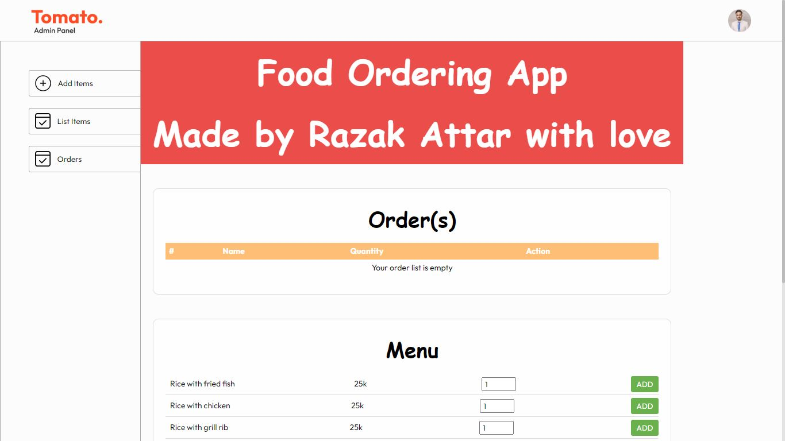
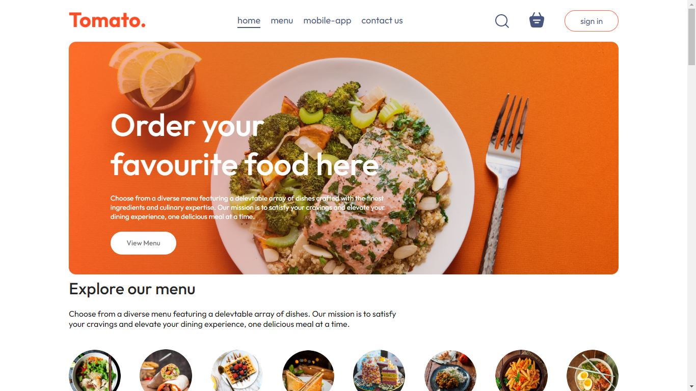
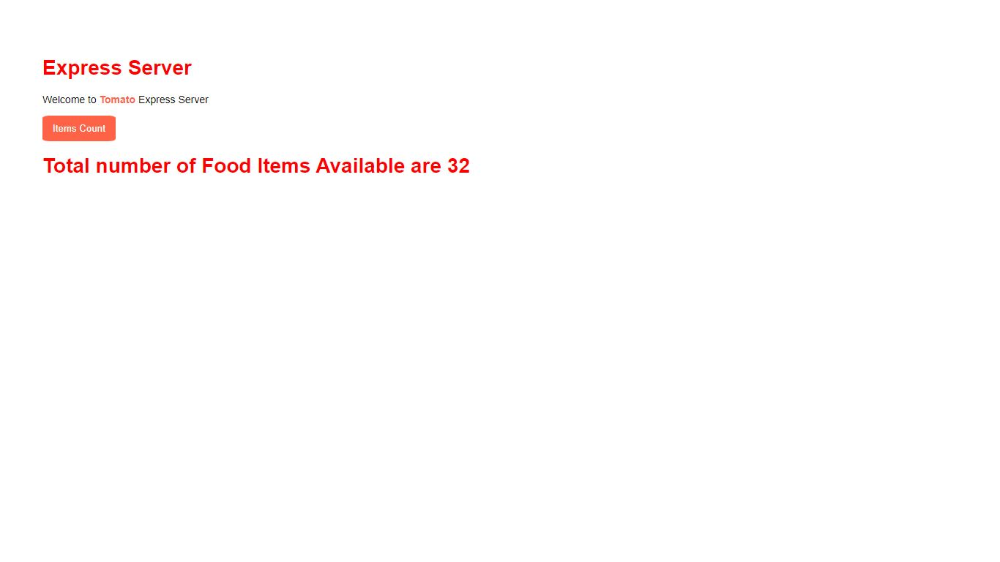

# Tomato - A Full Stack Food Delivery Application

### Hi, my name is **Razak**. Let me give you an introduction to this full stack project.

## Overview

Tomato is a full stack food delivery **MERN** application. It is fully responsive and includes two frontends, one for clients and one for admins, both utilizing a common backend.

### Frontends
- **Client Site**: Built with **React.js**
- **Admin Site**: Built with **React.js**

### Backend
- Built with **Node.js** and **Express.js**
- Database: **MongoDB**

## Features

### Admin Site

1. **Manage Foods**: Add and remove foods from the admin panel.
2. **Stock Control**: Remove out-of-stock items from the client site.
3. **Add New Items**: Easily add new food items from the admin panel.
4. **View All Foods**: See all food items added so far and remove any if necessary.
5. **Order Management**: View orders placed by customers. Update order statuses: *Food processing*, *Out for delivery*, and *Delivered*. Changes reflect in the database and client site.

### Client Site

1. **Authentication**: Users can register and create an account. A JWT token is created upon registration and the user is logged in automatically.
2. **Food Category Browsing**: Browse food items by category.
3. **Dynamic Food Items**: Items are fetched directly from the database, managed by the admin panel.
4. **Cart Functionality**: Add food items to the cart and proceed to checkout.
5. **Order Placement**: Fill out order details and place orders.
6. **Payment Integration**: Stripe integration for payments using debit cards. Orders are placed once payment is confirmed.
7. **Order Tracking**: Track order status: *Food processing*, *Out for delivery*, and *Delivered*. Status updates are managed by the admin panel.
8. **Order History**: Check past orders.

### Backend

1. **Data Management**: Schemas, models, controllers, routes, and endpoints are set up for all functionalities.
2. **CORS Enabled**: Both frontend sites are allowed for CORS.
3. **Payment Integration**: Secure payments with Stripe.
4. **Authentication**: JWT token-based authentication for user security.
5. **Ejs**: Enabled template engine or  view engine "ejs" for creating the views on server side by utilizing stylesheets for styling and javascript for dynamic tasks.

### Note
- JWT tokens are used for user authentication. Users must be logged in to place orders and access certain features.

## Technologies Used
- **React.js**: For both client and admin frontends. Utilizes JavaScript, JSX, plain CSS, and various npm packages.
- **Node.js** and **Express.js**: For backend server creation, API development (including authentication logic with JWT tokens), and database connections.
- **MongoDB (Atlas Cloud)**: As the database.
- **Stripe**: For payment integration.

#### For more details, feel free to contact me. Thank you.
